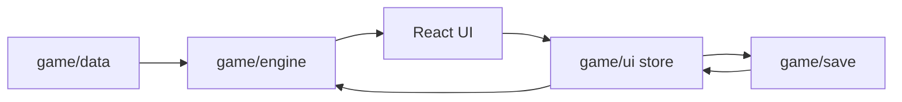
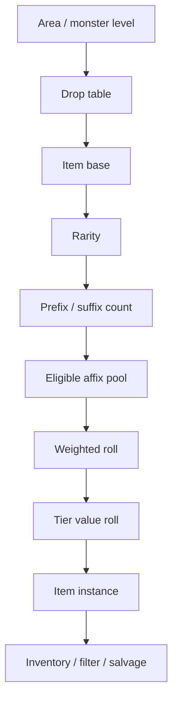

# Echo Forge 架構設計

日期：2026-06-30  
狀態：Draft v0.1

## 1. 架構目標

這個專案的架構目標是讓放置 ARPG 的數值與規則可以長期擴充，而不被 UI、存檔或未來後端綁死。

主要約束：

- engine 是純 TypeScript 邏輯。
- game data 是可版本化的靜態資料。
- UI 只負責呈現與操作。
- save schema 從第一天就 account-ready。
- 未來可把 offline reward 和高價值掉落移到 server-authoritative backend。

## 2. 技術棧

目前採用：

- Vite
- React
- TypeScript
- Zustand
- Zod
- Vitest
- Testing Library
- Lucide React icons
- CSS variables

暫不採用：

- Phaser：目前沒有即時 2D 場景。
- Three.js：目前沒有 3D 遊戲場景。
- Backend：MVP 1 前 local-only。

## 3. 高層分層

```text
Browser
  React UI
    Zustand UI/App State
      Engine Facade
        Pure Engine Modules
          Static Game Data
      Save Adapter
        Zod Schema
        LocalStorage / IndexedDB
```

資料流：



禁止方向：

```text
game/engine -> React
game/engine -> DOM
game/engine -> localStorage
game/engine -> network
game/data -> UI state
```

## 4. 目前目錄

```text
src/
  app/
    App.tsx
    App.css
  game/
    data/
      affixes.ts
      areas.ts
      classes.ts
      itemBases.ts
      skills.ts
      supports.ts
    engine/
      character.ts
      combat.ts
      defense.ts
      encounter.ts
      farming.ts
      itemScoring.ts
      items.ts
      loot.ts
      math.ts
      modifiers.ts
      offline.ts
      rng.ts
      simulation.ts
      types.ts
    save/
      localStore.ts
      migrations.ts
      schema.ts
    ui/
      store.ts
  styles/
    globals.css
  test/
    setup.ts
```

## 5. 目標目錄

MVP 1 後建議擴成：

```text
src/
  app/
    App.tsx
    routes.tsx
    layout/
  game/
    data/
      classes.ts
      skills.ts
      supports.ts
      itemBases.ts
      affixes.ts
      craftingCurrencies.ts
      areas.ts
      monsters.ts
      passiveNodes.ts
      dropTables.ts
      progression.ts
      balanceVersions.ts
    engine/
      rng.ts
      statTypes.ts
      modifiers.ts
      character.ts
      skills.ts
      combat.ts
      defense.ts
      itemGeneration.ts
      itemScoring.ts
      inventory.ts
      crafting.ts
      loot.ts
      areas.ts
      offline.ts
      progression.ts
      simulation.ts
    save/
      schema.ts
      migrations.ts
      localStore.ts
      importExport.ts
    services/
      accountAdapter.ts
      cloudSaveAdapter.ts
    ui/
      character/
      farm/
      inventory/
      loot/
      skills/
      passive/
      crafting/
      account/
      shared/
    assets/
      ui/
      icons/
      portraits/
  styles/
    theme.css
    globals.css
```

## 6. Engine 邊界

`src/game/engine` 的責任：

- 合併角色、裝備、技能、輔助、區域與被動提供的 modifiers。
- 執行戰鬥、防禦、掉寶、離線收益、物品生成與打造公式。
- 輸出 serializable summary 或 domain object。
- 保持 deterministic when seed is provided。

`src/game/engine` 不可做：

- import React。
- 讀寫 browser storage。
- 依賴目前畫面選取狀態。
- 直接格式化 UI 文案。
- 直接發 network request。

## 7. Data 邊界

`src/game/data` 的責任：

- 靜態內容。
- balance constants。
- stable IDs。
- 原創名稱與資料。

資料設計規則：

- ID 不等於顯示名稱。
- save 只存 ID 與必要 instance data。
- display name 可替換與 localization。
- 新增資料要不破壞舊 save。

範例：

```ts
{
  id: "skill_ember_lance",
  displayName: "Ember Lance",
  tags: ["spell", "projectile", "fire"],
}
```

## 8. Modifier 系統

核心型別：

```ts
type ModifierDef = {
  id: string;
  stat: StatId;
  type: ModifierType;
  value: number;
  tags?: SkillTag[];
  source: ModifierSource;
};
```

計算方式：

- `flat`：加到 base。
- `increased`：同 stat 加法桶。
- `reduced`：同 stat 減法桶。
- `more`：獨立乘算。
- `less`：獨立乘算懲罰。
- `penetration`：用於敵方 mitigation。
- `extraAs`：額外傷害。
- `cap`：上限。

可擴方向：

- damage conversion。
- enemy damage taken。
- ailment chance and effect。
- minion-specific modifiers。
- conditional uptime。

## 9. Combat Resolver

目前入口：

```ts
resolveCombat(build, areaId)
```

輸入來源：

- class base stats
- class growth
- build skill
- support modifiers
- build modifiers
- area enemy stats

輸出：

- averageHit
- dps
- hitChance
- critChance
- critExpectedMultiplier
- effectiveResistance
- hitsPerSecond
- bossTimeToKill

後續拆分建議：

- `skills.ts`：resolve skill loadout。
- `damagePipeline.ts`：傷害流水線。
- `enemyMitigation.ts`：抗性、護甲、格擋等。
- `combatReport.ts`：產出 debug trace。

## 10. Defense Resolver

目前入口：

```ts
resolveDefense(build, areaId)
```

輸出應保持能直接回答：

- 我會不會死？
- 我是被物理打死還是元素打死？
- 裝備變更讓 EHP 提升多少？
- death pressure 如何影響 farm efficiency？

後續擴充：

- one-shot threshold。
- recovery over time。
- ailment and stun pressure。
- boss burst model。

## 11. Loot Resolver

目前入口：

```ts
resolveLoot(build, areaId, combat, defense)
```

目前是 EV model，MVP 1 要新增 item instance model。

目標拆分：

```text
loot.ts
  calculateExpectedRewards
  rollRewardBundle
dropTables.ts
  resolveDropTable
itemGeneration.ts
  generateItem
itemScoring.ts
  scoreItemForBuild
inventory.ts
  applyLootFilter
```

## 12. 物品生成架構

MVP 1 新增：

```ts
type ItemInstance = {
  id: string;
  baseId: string;
  rarity: ItemRarity;
  itemLevel: number;
  affixes: RolledAffix[];
  quality?: number;
  locked?: boolean;
  generatedAt: string;
  generatedBy: {
    areaId: string;
    monsterLevel: number;
    balanceVersion: string;
    seed: string;
  };
};
```

生成流程：



工程規則：

- 所有 random 使用 `createRng(seed)`。
- 高價值結果必須保存 seed/provenance。
- 詞綴 eligibility 必須可測。
- 物品 instance 不可只靠 base data 推導，rolled affixes 要明確存。

## 13. Save 架構

目前：

- `schema.ts`：Zod schema。
- `localStore.ts`：localStorage adapter。
- `migrations.ts`：migration placeholder。

近期要調整：

- 小型設定繼續 localStorage。
- 角色、背包、掉寶紀錄、離線結算改 IndexedDB。
- export/import 使用完整 `AccountSave`。

未來 cloud save：

```text
Local client
  -> export account-shaped save
  -> login adapter
  -> cloud save adapter
  -> server validates schema and balance version
```

## 14. UI 架構

目前 UI 是單一 `App.tsx`。MVP 1 開始拆：

```text
game/ui/character/
  ClassSelector.tsx
  CharacterSummary.tsx
game/ui/farm/
  AreaSelector.tsx
  RouteSummary.tsx
game/ui/skills/
  SkillPanel.tsx
  SupportSocket.tsx
game/ui/inventory/
  InventoryList.tsx
  ItemCard.tsx
  EquipmentSlots.tsx
  ComparePanel.tsx
game/ui/crafting/
  CraftingBench.tsx
game/ui/shared/
  Metric.tsx
  Panel.tsx
  IconButton.tsx
```

UI state：

- selected class
- selected area
- selected inventory item
- active panel/drawer
- filter controls

Game state：

- account save
- roster
- equipment
- inventory
- currencies
- unlocks
- farm state

兩者必須分開。

## 15. Asset 架構

第一版以 CSS 和 icon library 為主。

後續資產：

```text
src/game/assets/
  icons/
    items/
    skills/
    currencies/
  portraits/
  backgrounds/
  audio/
```

規則：

- asset key 由 manifest 管理，不讓檔名成為 public API。
- 圖示和美術必須原創或授權可用。
- 技能與物品 icon 不仿 POE/POE2 原圖。

## 16. 測試架構

目前測試：

- modifier algebra
- combat resolver
- loot resolver
- deterministic RNG
- save schema

MVP 1 補：

- affix eligibility。
- prefix/suffix limits。
- weighted RNG sanity。
- item generation deterministic。
- item scoring delta。
- crafting legality。
- save migrations。
- offline cap and inventory overflow。
- React interaction tests for class/area/support toggles。

Browser QA：

- 用 dev server。
- 桌面 1440px。
- 筆電 1280px。
- 手機 390px。
- console error/warn scan。

## 17. Performance 架構

預期瓶頸：

- 長時間 loot feed。
- 大背包排序。
- 大量 item compare。
- offline settlement 一次產生大量物品。

策略：

- engine calculation pure and memoizable。
- item list virtualization。
- loot feed 保留最近 N 筆，完整紀錄進 IndexedDB。
- offline settlement 批次處理。
- heavy simulation 可移到 Web Worker。

## 18. Debug 架構

開發模式要有 debug panel：

- active build JSON。
- combat trace。
- defense trace。
- loot EV assumptions。
- RNG seed。
- save schema version。
- balance version。

Debug panel 不進一般玩家主要流程，但可在 dev mode 顯示。

## 19. Backend Readiness

未來後端候選：

- Supabase：最快 Auth + Postgres + cloud save。
- Firebase：最快 Auth + realtime，但複雜經濟較不理想。
- Custom Node/Fastify + Postgres：長期最穩，適合 server-authoritative economy。

後端化順序：

1. auth and cloud save。
2. server-side save validation。
3. server-side offline settlement。
4. server-owned high-value item generation。
5. seasons/leaderboards/trade-like economy。

## 20. 架構決策紀錄

ADR-001：React dashboard first。

- 原因：此遊戲第一版是數值與 UI 密集型，不是即時動作場景。
- 結果：不使用 Phaser/Three.js 作為第一 runtime。

ADR-002：Engine pure TypeScript。

- 原因：公式、掉寶、存檔、未來後端都需要重用與測試。
- 結果：engine 禁止依賴 React/DOM/storage。

ADR-003：Skill panel sockets, not gear sockets。

- 原因：放置網頁 UI 中，換裝不應破壞技能配置。
- 結果：技能與輔助模組獨立於裝備欄。

ADR-004：Account-shaped save from day one。

- 原因：未來明確要帳號與雲端。
- 結果：local save 也採 `AccountSave`。
